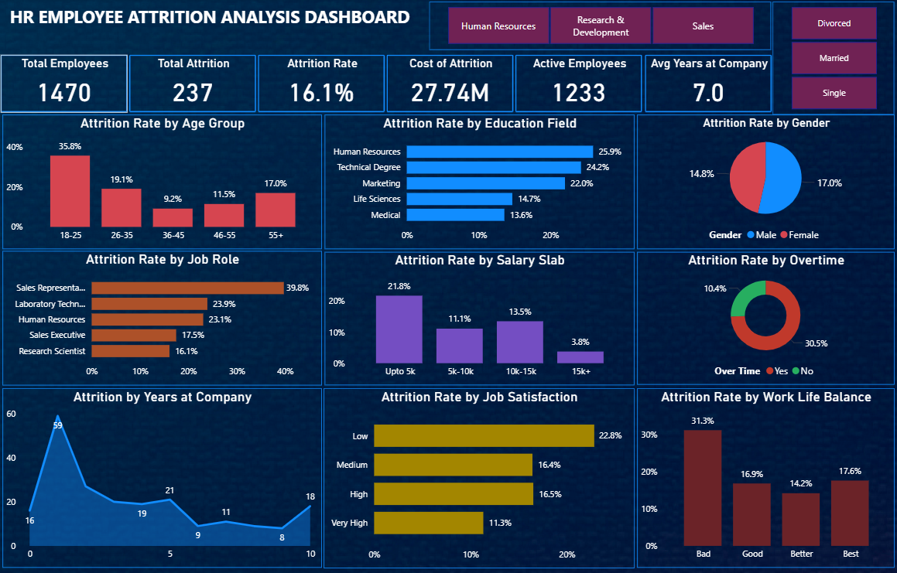
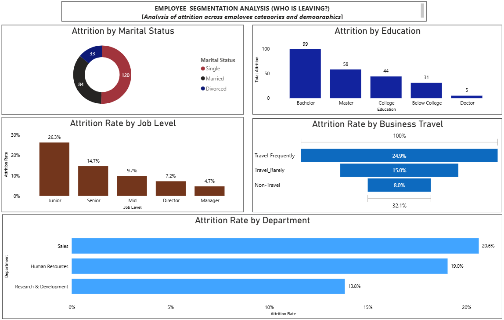
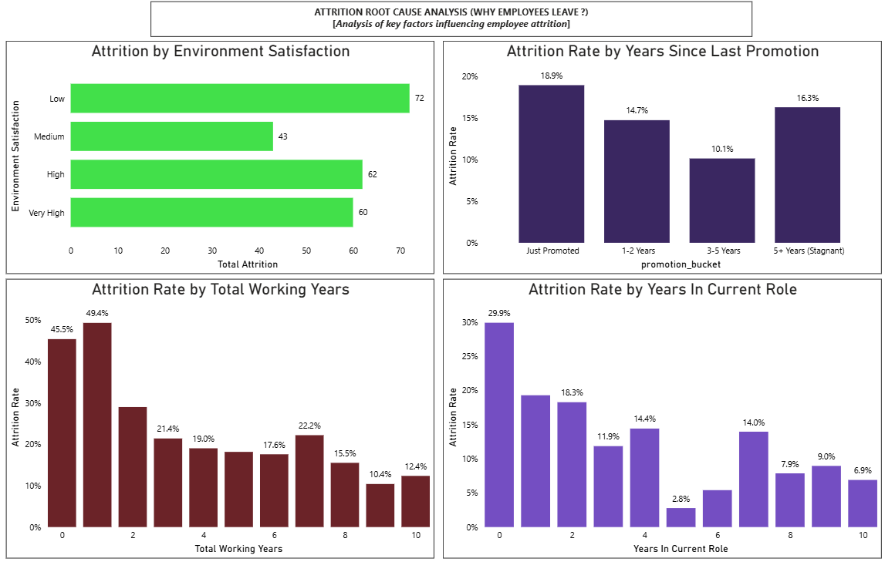

# HR Employee Attrition Analysis Dashboard


### Power BI | PostgreSQL | Power Query | DAX | HR Analytics


---

## Objective
To analyze employee attrition patterns using Power BI and PostgreSQL by examining demographic, job-related, compensation, and satisfaction factors, and to identify the key drivers associated with employee turnover through data-driven insights and interactive visualizations.

---

## Tools & Technologies
| Tool | Purpose |
|---|---|
| Power BI Desktop | Dashboard Development & Visualization |
| PostgreSQL | Data Analysis & Querying |
| Power Query | Data Cleaning & Transformation |
| DAX | KPI & Measure Development |

---

## Dataset Overview
- Records: 1,470 employee records
- Variables: 34 employee-related attributes
- Domain: Human Resources

---

## Data Preparation
- Removed zero-variance columns that provided no analytical value
- Eliminated redundant identifiers and duplicate records
- Fixed categorical inconsistencies and standardized text values
- Replaced numeric rating values with business-friendly descriptive labels
- Renamed columns for reporting consistency and readability
- Created custom sort columns for proper business-order visualization in Power BI
- Created Attrition Flag for attrition rate calculations

---

## Project Workflow

```text
Raw HR Dataset
        ↓
Power Query Data Cleaning
        ↓
Data Transformation & Preparation
        ↓
PostgreSQL Analysis
        ↓
DAX Measure Development
        ↓
Interactive Power BI Dashboard
        ↓
Attrition Insights
```

---

## Analytical Approach

### PostgreSQL Analysis
- Performed attrition analysis across demographic, compensation, satisfaction, and workforce dimensions
- Applied aggregation functions, CASE-based segmentation, and custom sorting logic
- Calculated attrition counts and attrition rates across multiple employee groups

### Power BI Analysis
- Built interactive dashboards for employee attrition exploration
- Developed DAX measures for attrition KPI and satisfaction analysis
- Implemented custom sorting logic and dynamic visual interactions
- Designed business-focused visuals for workforce trend analysis

---

## SQL Samples

A small collection of representative PostgreSQL queries used in this project is available in the `sql-samples` folder.
The complete SQL analysis library is not publicly distributed.

---

## Dashboard Preview

### HR Attrition Overview Dashboard


### Employee Segmentation Analysis


### Attrition Root Cause Analysis


---

## Key Business Insights
1. Overall employee attrition rate was 16.12%
2. Employees working overtime experienced nearly 3× higher attrition than employees without overtime
3. Sales Representatives recorded the highest attrition among all job roles
4. Lower salary groups demonstrated elevated attrition risk compared to higher salary bands
5. Employees reporting poor work-life balance showed significantly higher turnover
6. Frequent business travel was associated with increased employee attrition

---

### Project Access

This repository showcases the project outcomes, methodology, dashboard visuals, and business insights.
To preserve the originality of the work, the following assets are not publicly distributed:
- Source datasets
- Power Query transformation steps
- Complete DAX measure library
- Power BI (.pbix) file
- Complete PostgreSQL query scripts
- Business recommendations
The repository is intended to demonstrate analytical thinking, data preparation, dashboard design, SQL analysis, and business insight generation.
Additional implementation details, technical decisions, and project walkthroughs can be discussed during interviews or portfolio reviews.

---

## 👤 Author

**Victor Sarmacharjee**  
Aspiring Data Analyst

[LinkedIn](https://www.linkedin.com/in/victorsa09/)
